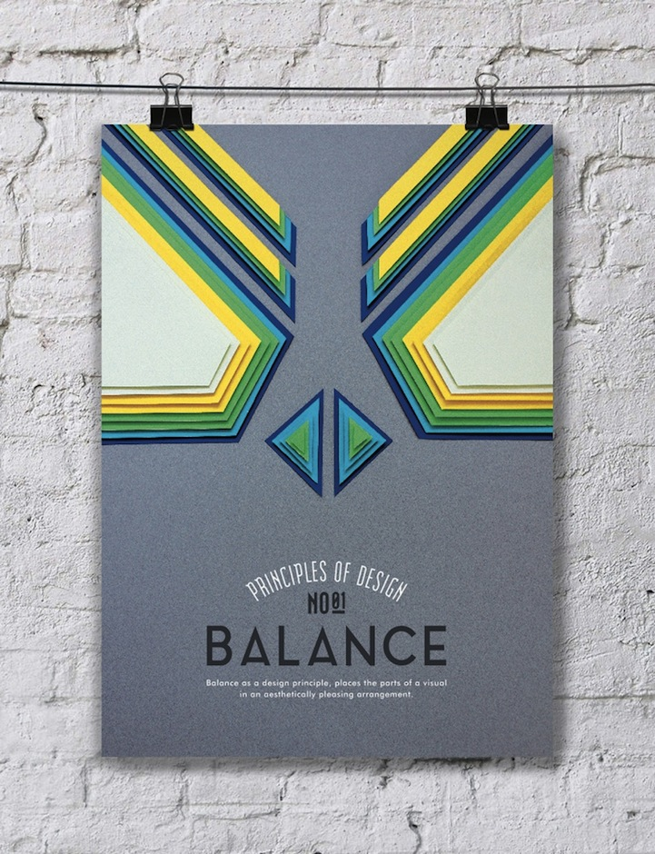
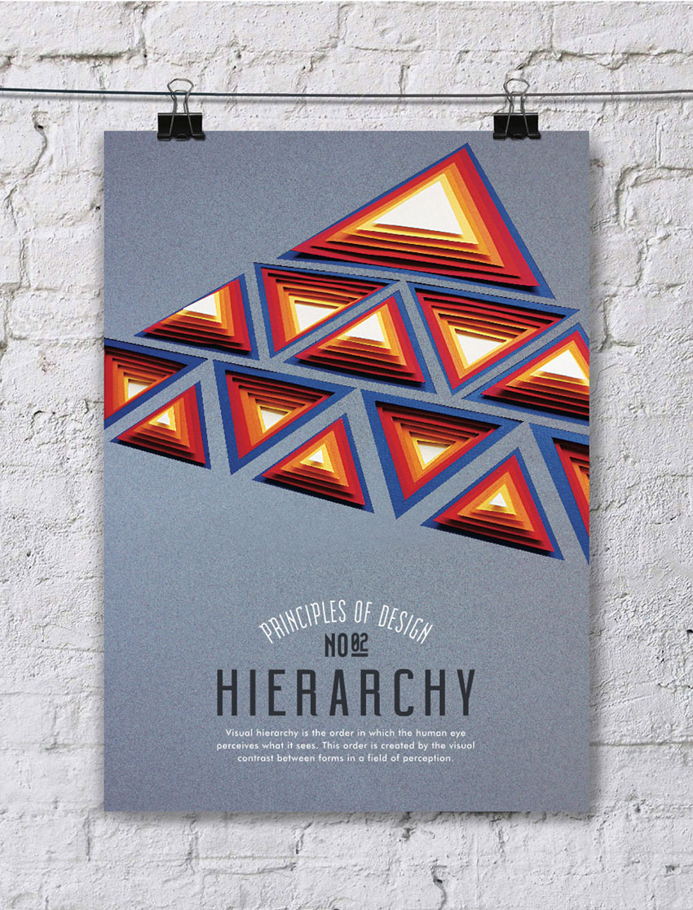
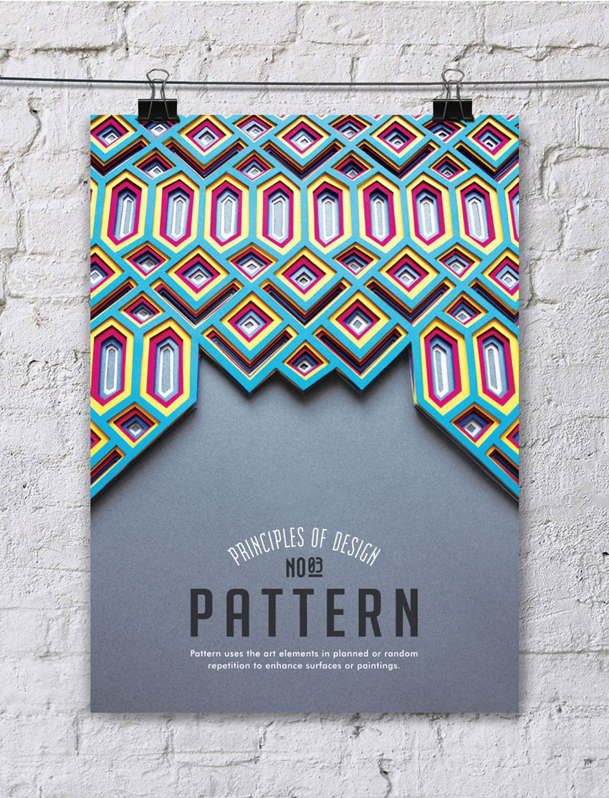
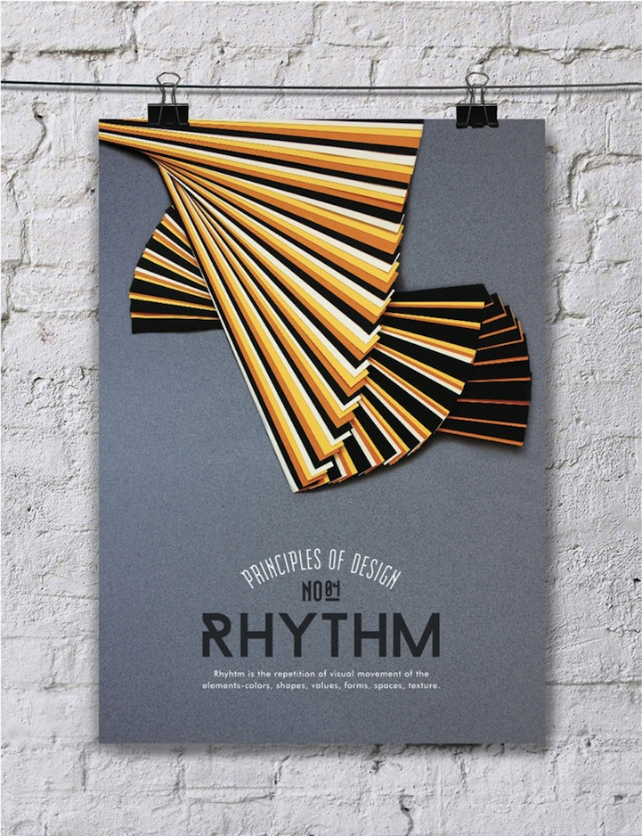
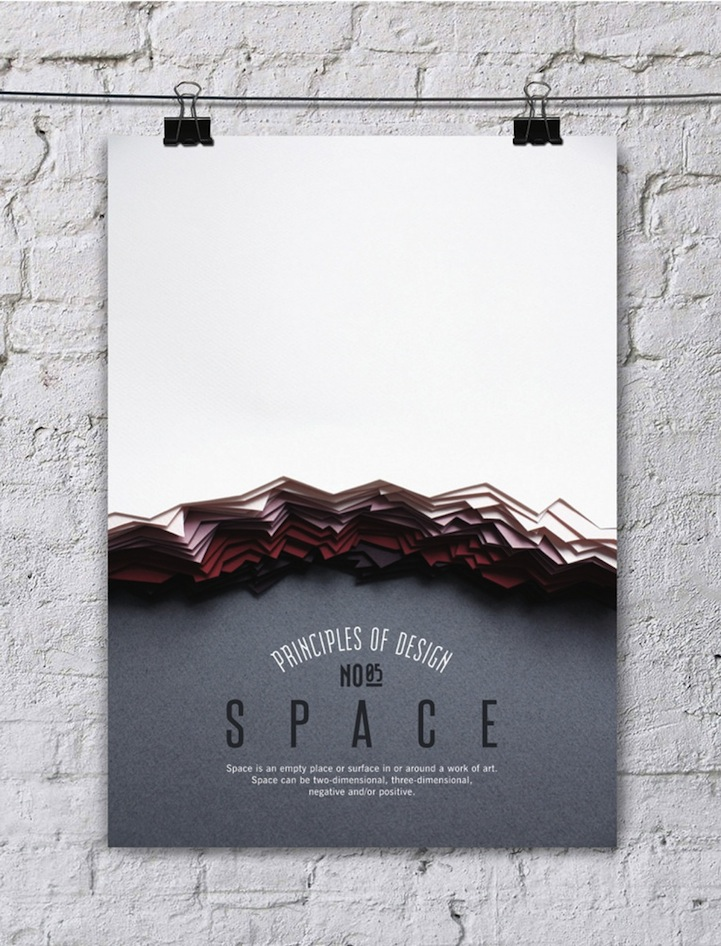
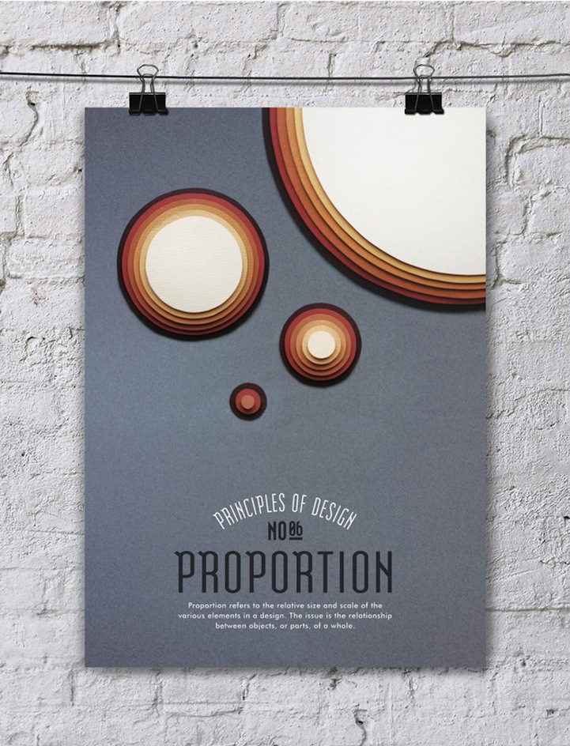
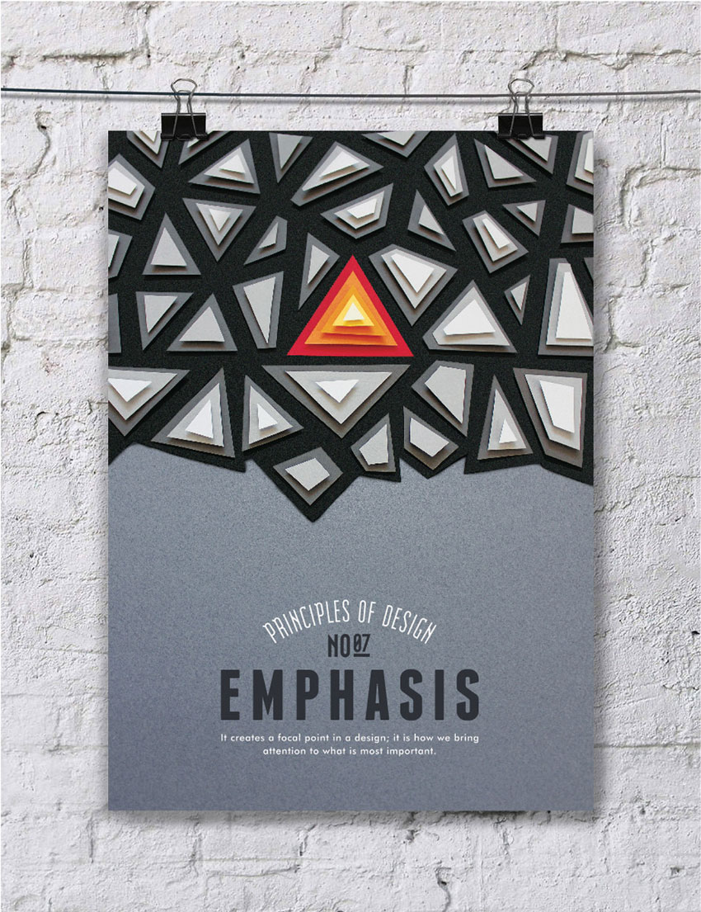
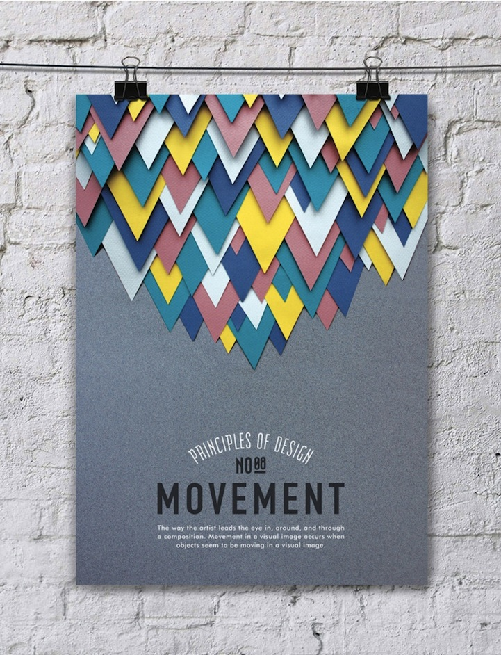
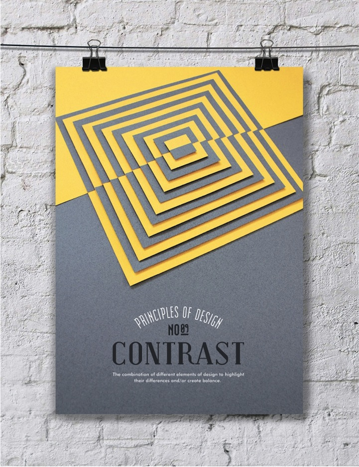
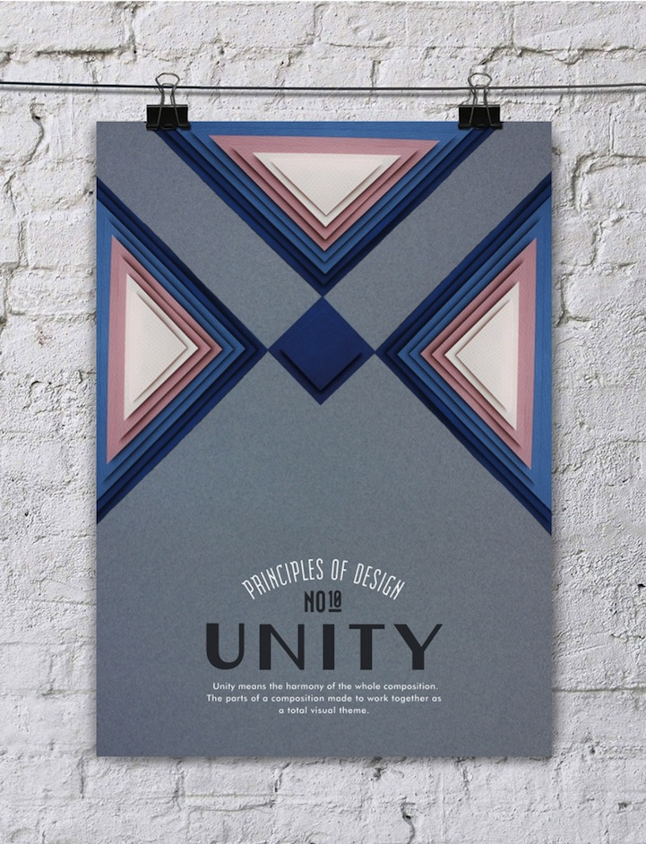

### ۱- اصول طراحی و ترکیب بندی

در این قسمت به اصول طراحی و ترکیب‌بندی که با کاغذ درست شده است، می‌پردازیم. این ده اصل در طراحی اگر رعایت شود بهترین اثر هنری (گرافیکی و ... ) خلق می‌شود. که سلسله مراتب، تعادل، الگو، فضا، ریتم، تاکید، تناسب، جنبش،  وحدت و تضاد، ده اصل طراحی هستند. (لطفا در دیدن عکس‌ها دقت کنید!)

### ۱- تعادل - Balance

### ۲- سلسله مراتب - Hierarchy

### ۳- الگو - Pattern

### ۴- ریتم - Rhythm

### ۵- فضا (فضای سفید یا خالی) - Space

### ۶- تناسب - Proportion

 ### ۷- تاکید - Emphasis

### ۸- حرکت - Movement

### ۹- تضاد - Contrast

### ۱۰ - پیوستگی یا Unity

