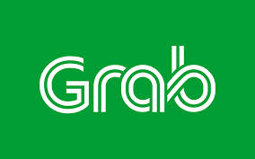

دو روز پیش صفحه زود‌فود (اسنپ فود!) رو اتفاقی باز کردم و دیدم لوگو تغییر کرده، بعد از جستجو در محصولات شرکت‌های مرتبط گروه اینترنتی ایران فهمیدم قصد تغییر استراتژی برند، هویت بصری و ریبرندیگ رو داشته.
چون سرکار بودم زیاد وقت نکردم خوب نگاهش کنم تا امروز صبح تصمیم گرفتم این لوگو رو خوب بررسی کنم. متاسفانه ایراد‌های عجیبی توش پیدا کردم که برایم خیلی جای تعجب داشت که اسنپ چرا باید انقدر عجول باشه در داشتن خروجی پر‌ از ایراد!
بعد از اینکه ایراد‌‌ها رو به همکارانم گفتم اونا حس می‌کردن سرویس اسنپ چقدر ضعیف شده که حتی یک ماشین هم گیر نمیاد با این لوگوشون!
بگذریم، برسیم به مبحث اصلی که می‌خواستم ایراد‌های گرافیکی و تایپوگرافی لوگو رو لیست کنم.

ایراد شماره ۱ - این ایراد در واقع یک اصل اساسی در طراحی لوگو هست که طراح گرامی سعی داشته اصل قرینه بودن در طراحی رو رعایت کنه، ولی با رعایت کردن این اصل به اصل تایپوگرافی حرف a توجه نکرده، همین امر باعث شده ایراد در حرف a به وجود بیاد!

ایراد شماره ۲ - هم حرف a، از نظر تایپ حرف درست نیست و هم نوع گرافیکی این حرف مشکل اساسی در طراحی دارد. در شکل زیر، فونت Futura بررسی شده است. که شکل و تایپ براساس طرح کلی فونت بصورت لبه‌های تیز و انحنا در تایپ حرف‌ها است. در واقع پیوستگی رعایت شده است ولی در لوگو این پیوستگی و اتحاد دیده نمی‌شود.
فونت نوع هندسی Futura و لوگو اسنپ!

همین‌طور که مشاهده می‌کنید اگر لوگو‌تایپ اسنپ از فونت هندسی Futura استفاده کرده باشه، فقط لبه‌های تیز این فونت رو انحنادار کرده است. ولی ده اصول طراحی که تعادل، سلسله مراتب، الگو، ریتم، فضا خالی، تناسب، تاکید، حرکت، تضاد و وحدت می‌باشد را رعایت نکرده است.

ایراد شماره ۳ - این ایراد خیلی واضح هست و با دقت کردن متوجه یکسان نبودن قطر حرف S و قرینه نبودن گوشه‌های این حرف می‌شویم.

ایراد ۴ و ۵ - اینکه کلمه مخفف - TM - Trade Mark لوگو پشت لوگو اومده می‌تونه نظر طراح محترم باشه ولی با توجه به اصول این کلمه باید در ستون جلویی لوگو‌تایپ یا لوگو آورده می‌شد که متاسفانه این مورد هم رعایت نشده.

حالا به لوگو خوب دقت کنید:

مورد مهم بعدی رنگ سرد انتخاب شده توسط طراح هست. این رنگ سردی زیادی به آدم القا می‌کنه جوری که هیچ انرژی‌ایی در این رنگ نیست و حس مریض بودن با همنشینی این رنگ القا میشه. حتی رنگ‌ اتاق عمل و پزشکان اتاق عمل از این رنگ تیره‌تر هست. با این که رنگ سبز حس زندگی و سر زنده بودن رو القا می‌کنه ولی با توجه به حرکت لوگو انتظار انرژیک بودن ازش میره که چنین چیزی دیده نمیشه!
از نظر رنگ مخالف رنگ سبز نیستم چرا که این رنگ علاوه بر زندگی، شادابی و ... نماد ایمن بودن هم می‌دهد که فقط با سرد بودن این رنگ مخالفم که خوب نیست بحث سلیقه در کار باشه، بهتر بود اصولی‌تر انتخاب می‌شد و طیف دیگه‌ایی از رنگ سبز انتخاب می‌شد.

این رنگ سبز منو یاد شرکت Grab می‌اندازد که شاید من این طیف رنگ رو انتخاب می‌کنم. شرکت گرب یک شرکت سنگاپوری که در سال ۲۰۱۲ شروع بکار کرد. که در بخش اشتراک سفر، اشتراک وسیله نقلیه، صنعت حمل و نقل و خدمات تحویل غذا در حال فعالیت است.

لوگو گرب در تمامی بخش‌ها (حمل‌ و نقل، خدمات تحویل غذا و اشتراک‌گذاری وسایل‌نقیله (ماشین، دوچرخه و ...) یکسان است.

شاید با خودتون بگید مسئول، کارشناس و همکاران که در طراحی این لوگو سهیم بودن چرا توجهی به اصول نداشتن و فقط دنبال تغییر لوگو برای ریبرندینگ بودن؟

با این حال بنده از دید کسی که در رشته نرم‌افزار تحصیل کرده و کتاب‌های زیادی در مورد گرافیک خوانده‌‌ام نظر خودم رو با توجه به اصول برای این تغییر بسیار سریع و به نظرم فکر نشده دادم.
امیدوارم کسانی که در این راه و مسیر هستن به مخاطبان خودشون احترام بیشتری بذارن و سعی کنن هر چند در محدودیت‌ها هستیم ولی با اصول و دقت بیشتری به کارهامون برسیم.
این مطلب خالی از ایراد نیست! از بانشر و کپی نکردن مطلب پیشاپیش تشکر می‌کنم :)